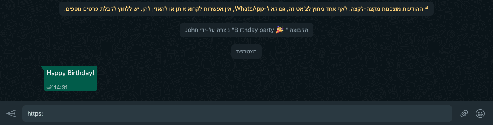

# Dalle Preview

__The fastest way to generate [Dalle 2](https://openai.com/dall-e-2/) images__

This project uses the [Open Graph Protocol](https://ogp.me/) to enable creating and sending Dalle 2 images right from your messaging apps.


## Usage

Write `https://dalle-preview.co/<your image description>` in WhatsApp/Discord/Facebook/etc.. and a preview of the generated image will appear (it can take a couple of seconds for the preview to appear).



## Deploying to AWS

First, generate the package for the AWS lambda by running:
```
pipenv run package
```

Then, deploy all the AWS services by running:
```
pipenv run deploy -var="domain=<the domain name of your web service>" -var="dalle_api_key=<the api key for using the Dalle API>"
```
